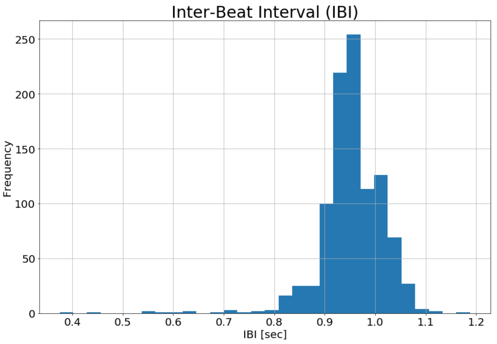
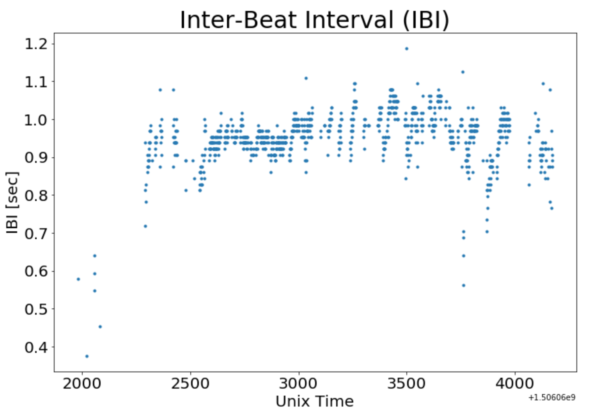
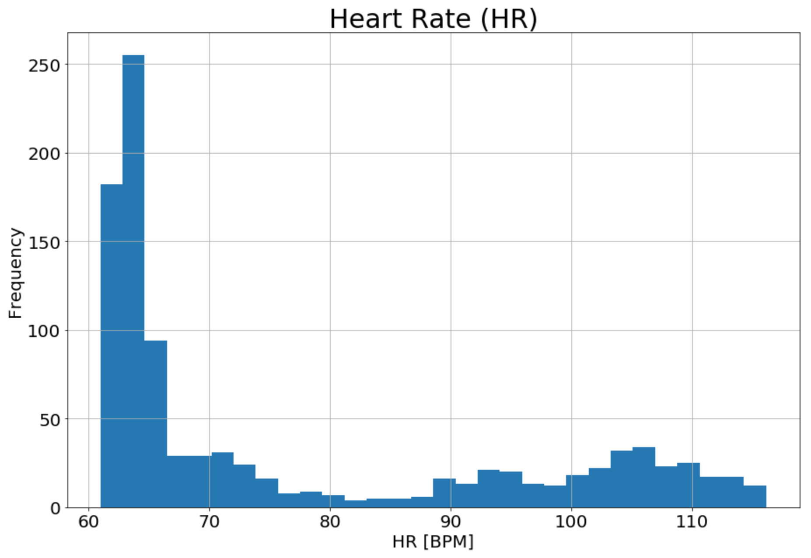
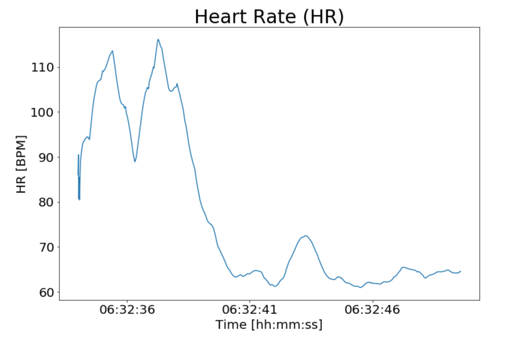

This is a reconstructed historical note from my first work with wearable sensor data at Early Signal, shortly before the Early Signal team merged into CVB. The work was part of the beginning of our relationship with the Michael J. Fox Foundation around Parkinson's, mobile/wearable sensors, and digital biomarkers.

The original material was not a polished article. It was a pair of September 2018 slide decks: one broad data-exploration deck dated September 5, and a short demo-slide deck dated September 26. The point of preserving it here is not that the analysis was especially glamorous. It was the first practical pass through the raw shape of wearable data: what signals exist, what files look like, how timestamps work, what basic quality checks are needed, and what a first visualization pass can reveal.

## Why This Was A Useful First Step

Wearable data looks simple from far away: a wristband, a gait sensor, a phone, maybe a watch. Up close it becomes a small ecosystem of sensor streams, sampling rates, file formats, timing conventions, derived signals, missingness, artifact, and device-specific assumptions.

That was the useful lesson in this first pass. Before modeling anything, the first job was to answer plain questions:

- What data streams do these devices emit?
- Which streams are raw sensor signals and which are derived?
- Can timestamps be reconstructed reliably?
- Which streams are sampled uniformly, and which are event-based?
- What values are obviously impossible or suspicious?
- Which derived quantities depend on signal quality from another sensor?
- What plots make the data legible enough to discuss with the team?

That kind of plumbing work is easy to overlook, but it is where a lot of applied wearable ML begins.

## Devices In The Early Pass

The September 5 deck focused mostly on the Empatica E4 wristband, with short placeholders for Physilog shoe-strap sensors, smartphone data, and smartwatch data.

The Empatica E4 streams included:

| Stream | Sampling / Structure | Notes |
| --- | --- | --- |
| `ACC.csv` | 3-axis accelerometer, sampled at 32 Hz | Motion and activity-sensitive stream. |
| `BVP.csv` | Blood volume pulse, sampled at 64 Hz | PPG-derived waveform used downstream for heart-related features. |
| `EDA.csv` | Electrodermal activity, sampled at 4 Hz | Skin-conductance signal, often sensitive to stress/arousal and artifact. |
| `TEMP.csv` | Skin temperature, sampled at 4 Hz | Peripheral temperature stream. |
| `HR.csv` | Heart-rate estimate | Derived from PPG/BVP, so quality depends on usable optical signal. |
| `IBI.csv` | Event-based inter-beat intervals | Irregular/event stream rather than a simple fixed-rate sensor table. |
| `tags.csv` | Event markers | User/device event markers. |

The Physilog material was thinner in these decks, but it sat in the same wearable-sensing world: motion sensors attached around the shoes, with obvious relevance to gait and movement analytics.

## The CSV Details Matter

One detail that stood out in the original slides was how much basic interpretation depended on reconstructing time correctly.

For fixed-rate Empatica streams, the raw files were organized around an initial timestamp and a sampling rate. Analytically, that means the timestamp for a row can be reconstructed as:

```text
timestamp_i = t0 + i / sampling_rate
```

The September 2018 notes specifically called out the relevant sampling rates:

- `ACC.csv`: 32 Hz
- `BVP.csv`: 64 Hz
- `EDA.csv`: 4 Hz
- `TEMP.csv`: 4 Hz

That is a small but important practical point. A dataset like this is not one clean rectangular table. It is a collection of streams with different clocks, different meanings, and different quality constraints. If you want to join, window, summarize, or model those signals, the first real task is to respect those differences.

`IBI.csv` had its own structure. Instead of a row-per-sample fixed-rate stream, it records detected beat intervals. The slide notes described the first value as the initial time and subsequent rows as a pair: a time offset and the IBI value, reported only when the BVP signal is clear enough for identifiable beats.

## First Glimpse Plots

The September 26 demo slide added the more useful visual evidence: first-pass plots of inter-beat intervals and heart rate.



The IBI histogram is the kind of plot I would still make early in a wearable-data project. It gives a quick sanity check on the typical range, the tail, and potential artifacts. Even before doing anything sophisticated, a distribution plot can tell you whether the signal lives where you expect it to live.



The time plot adds something the histogram cannot: whether odd values are scattered randomly, clustered in a particular interval, or connected to a transition in signal quality. In this case the lower IBI values early in the segment and later dips would be exactly the sort of thing I would want to compare against motion, BVP quality, and any device/event notes before treating them as physiologically meaningful.



The heart-rate histogram is also more interesting than a single summary number. It suggests that this short sample is not just one stable operating regime. Some values cluster near resting-ish ranges, while others extend much higher. That does not automatically mean anything clinically meaningful; at this stage it is a prompt to inspect timing, movement, activity context, and signal quality.



The heart-rate time plot makes that point more directly. A short segment can contain sharp changes, settling behavior, and periods that look qualitatively different from one another. Those visible dynamics are why wearable data usually needs more than global summary statistics.

## QC Before Modeling

The short September 26 demo deck had a concise quality-control framing that still feels right.

Basic QC can start with common-sense checks:

- minimum and maximum values
- first differences
- missing or repeated timestamps
- unrealistic jumps
- impossible sensor values

But some streams need more context. For example, several Empatica quantities are derived from the PPG/BVP sensor. A heart-rate estimate or inter-beat interval is only as trustworthy as the underlying optical signal and beat-detection process. That means quality checks may need to consider whether the source signal was valid, not just whether the derived number falls in a plausible range.

This is one of the early lessons that carried forward into later wearable and time-series work: the hard part is often not plotting the line; it is knowing when the line should be believed.

## What This Foreshadowed

Looking back, this small exploration foreshadowed a lot of later work:

- sensor stream parsing and timestamp alignment
- multi-rate time-series preprocessing
- basic and context-aware quality control
- windowed feature extraction
- human activity recognition
- wearable/device validation
- digital biomarker thinking
- domain differences across devices, studies, and populations

It also marks an important personal milestone: this was my first practical contact with the kind of wearable data that later became central to my CVB-era work on human activity recognition, Parkinson's/wearables projects, sleep-device validation, time-series data augmentation, and sensor-domain adaptation.

## Source Note

This article was reconstructed in 2026 from two September 2018 slide decks. The plot images were extracted from the September 26 demo deck; local provenance notes and review copies are kept in the gitignored quarantine area.

Source decks:

- `2018-09-05_MJF001_Data-Exploration.pptx`
- `2018-09-26_MJFF-EaSi_demo-slide.pptx`
