# Playing with Hyperparameters

> Historical provenance and source draft details are at [Historical Provenance](#historical-provenance).

## Notes

In the latest edition ([Aug 14, 2019](https://info.deeplearning.ai/the-batch-optimization-tutorial-plus-greener-ai-better-recommenders-generative-models-claiming-patents))
of [The Batch](https://www.deeplearning.ai/thebatch/), Andrew Ng's AI newsletter, there is a
[hyperparameter/optimization tutorial](https://www.deeplearning.ai/ai-notes/optimization/) that
includes a bunch of interactive tools to help develop an intuition for optimization.  For example,
there is one tool that helps show how a batch size of 1, 24, or the entire data set will affect
the convergence and trajectory of the cost function's value while seeking its minimum.  The same tool
allows one to tweak the learning rate (small, medium, large) and training set size as well.

The really cool interactive tool, however, is at the end of the article.  It allows you to choose from a variety of cost
function landscapes and compare how different optimizers traverse the space given some learning rate, learning
rate decay, and starting position (weight initialization).  It was interesting to see the differences in
gradient descent, momentum, RMSProp, and Adam, in terms of trajectory, solution speed, and robustness across
landscapes.  In this short article, I just wanted to record some of my observations.

(Btw, another cool tool is [TensorFlow Playground](https://playground.tensorflow.org/), which I found incredibly
helpful a few years ago when I was learning this stuff.)

This follow-up note preserves observations from a 2019 slide deck where I played
with that optimization tool across several loss landscapes. The point was not to
benchmark the optimizers in any rigorous way. It was to build intuition for how
learning rate, learning-rate decay, initialization, and optimizer choice can
change the actual path through parameter space.

## Summary

- Optimizer choice changes more than convergence speed. In non-convex
  landscapes, different optimizers can follow different trajectories and
  sometimes settle into different local minima.
- Momentum looked very fast at small learning rates, but it became brittle as the
  learning rate increased.
- RMSProp and Adam were more robust across a wide range of learning-rate and
  decay settings, even when they were not always the fastest.
- Learning-rate decay could rescue surprisingly large learning rates, especially
  for Adam and RMSProp.
- Initialization mattered a lot. In some examples, all optimizers agreed with
  each other and were still wrong in the sense that they converged to the same
  suboptimal basin.

## Himmelblau's Function

With a small learning rate and no decay, momentum often reached the solution
quickly. Its trajectory could look wild compared with plain gradient descent, but
it still converged cleanly in the runs I tried.

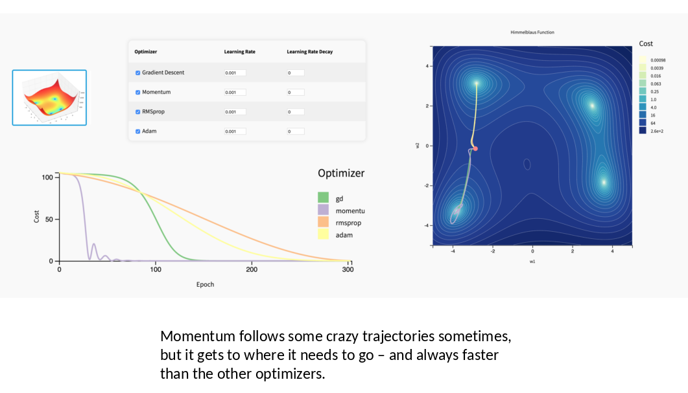

*Small learning rate, no decay: momentum takes a less direct path, but reaches a
minimum quickly.*

As the learning rate increased, the story changed. Plain gradient descent and
momentum started to lose their clean behavior, while RMSProp and Adam handled the
same setting much more smoothly.

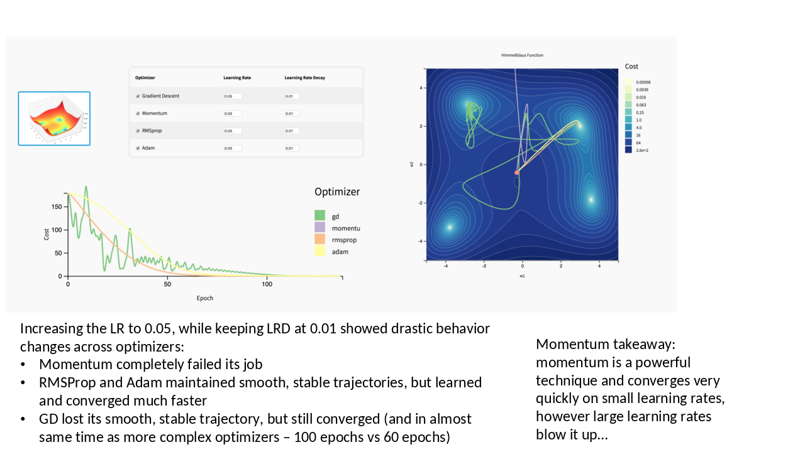

*At a larger learning rate, momentum fails while RMSProp and Adam remain stable.*

At still larger learning rates, RMSProp and Adam could converge very quickly, but
there were small bumps out of the optimum. In practice, that means the exact
training stop point can matter. Increasing the decay helped settle those
oscillations.

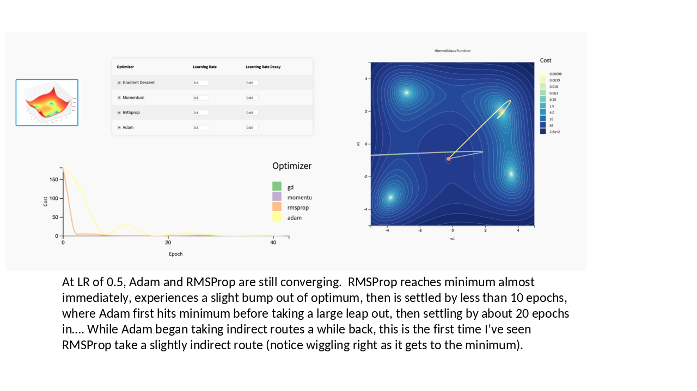

*RMSProp and Adam still converge at high learning rates, but small post-convergence
bumps begin to appear.*

One of the more memorable observations was that a very large learning rate could
still work if the decay was aggressive enough. That is not a rule of thumb I would
use blindly, but it made the interaction between learning rate and decay feel much
more concrete.

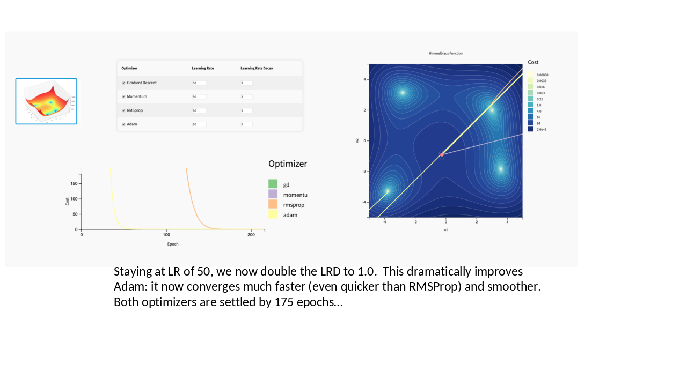

*A very high learning rate can be tamed by stronger decay in this toy landscape.*

The strongest intuitive takeaway from this landscape was that RMSProp and Adam
were safe over a broader range of settings, while momentum was excellent only
inside a narrower hyperparameter region.

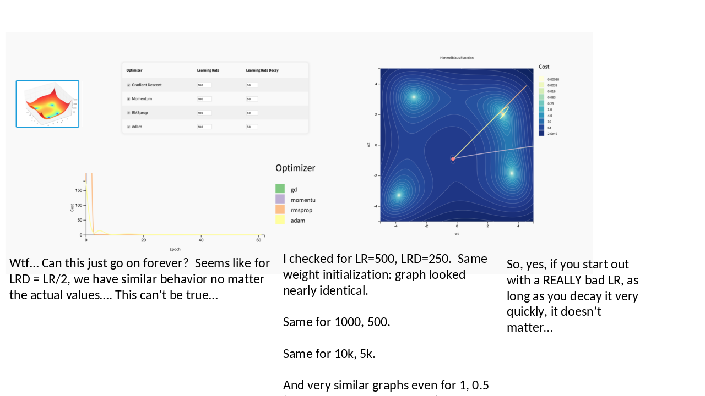

*The original slide note records how similar behavior appeared when learning rate
and decay were scaled together.*

## Styblinski-Tang Function

The Styblinski-Tang runs made initialization feel more important. In some cases,
all optimizers agreed on the same basin, but the result was still not the global
minimum.

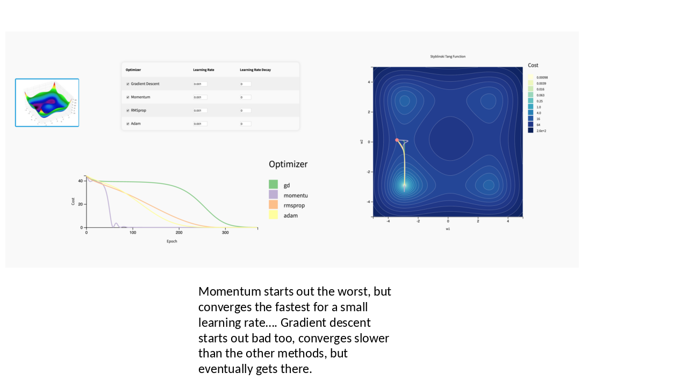

*At small learning rates, momentum again converges quickly, but all optimizers can
still end up in the same non-global basin.*

Increasing the learning rate slightly made momentum much less trustworthy. In one
run, momentum diverged while plain gradient descent, RMSProp, and Adam still made
their way to a solution.

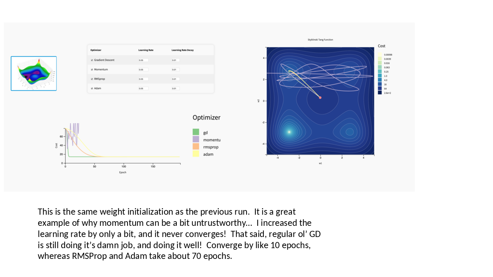

*Momentum can go from fast to unstable with a modest learning-rate increase.*

The Adam runs were especially interesting. At some learning rates, Adam's early
oscillation gave it enough exploration to find the global basin. At nearby
learning rates, it returned to a suboptimal one. This made Adam feel more
exploratory than RMSProp, but not predictably so.

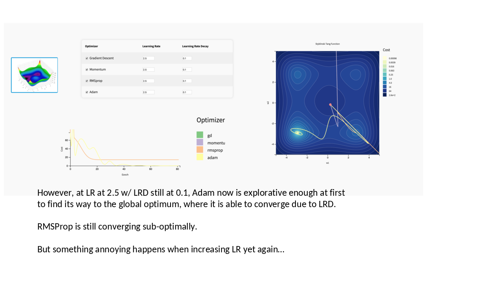

*Adam occasionally explores enough to find the global optimum, while RMSProp stays
with a steadier local-basin trajectory.*

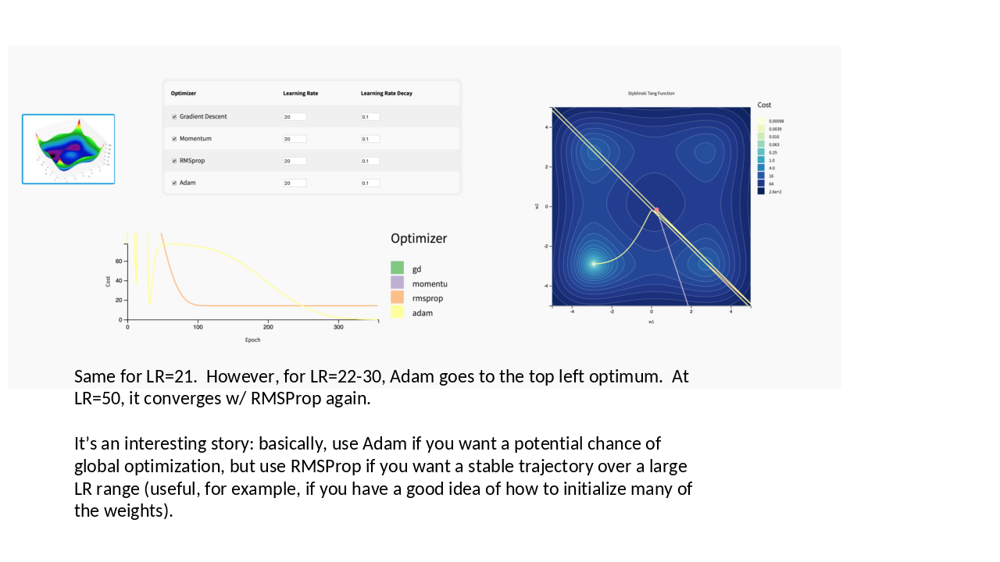

*The later Styblinski-Tang runs suggested a tradeoff: Adam may explore more, while
RMSProp can be more trajectory-stable over a wide learning-rate range.*

## Rosenbrock Function

The Rosenbrock examples exposed another kind of sensitivity. Gradient descent and
momentum could be quick in some low-learning-rate settings, but the landscape also
revealed blow-ups and slow regimes that were much less obvious from the simpler
examples.

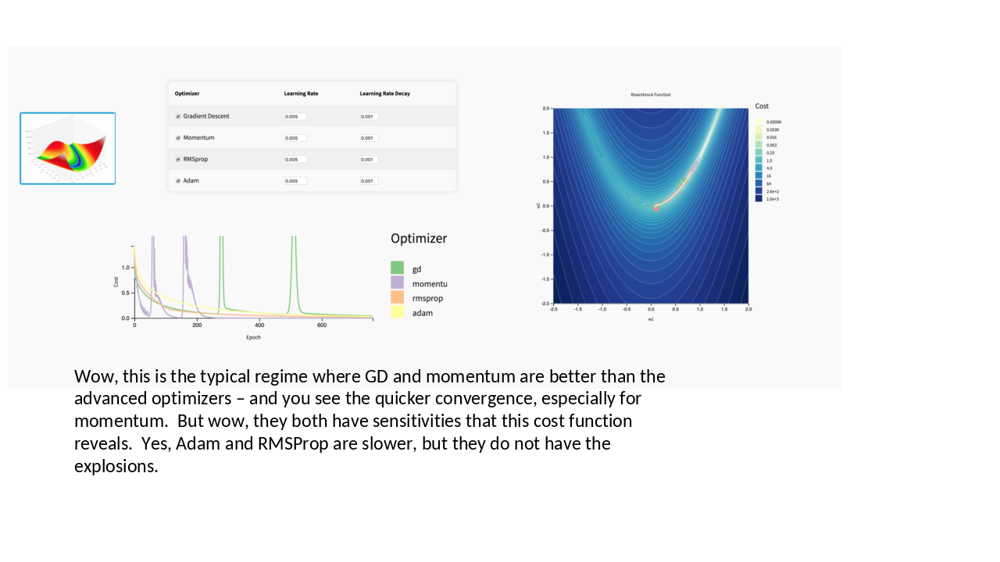

*Rosenbrock made the tradeoff between fast convergence and optimizer sensitivity
very visible.*

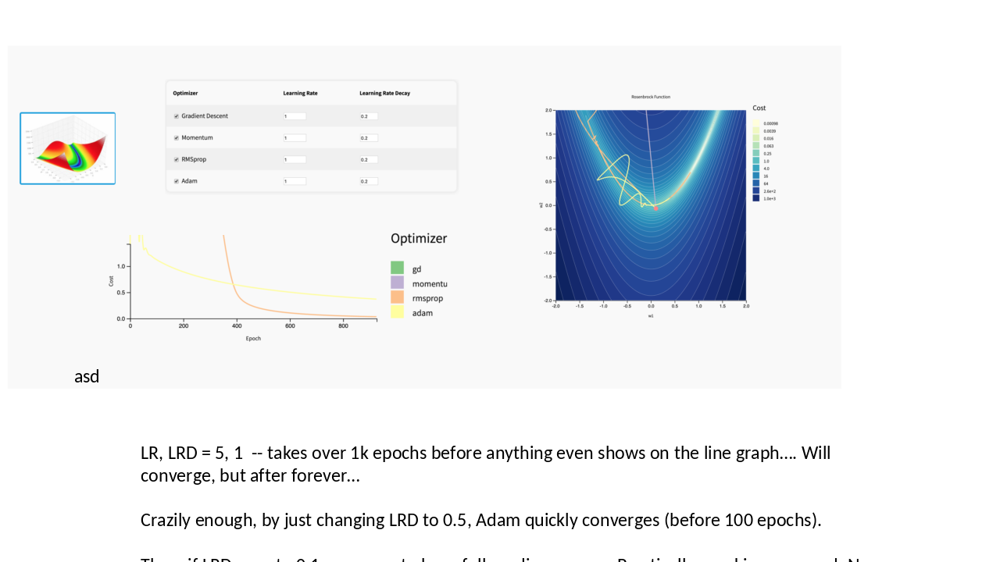

*Small changes in decay could move the same optimizer from slow convergence to
fast convergence to practical divergence.*

## What This Helped Me See

This was useful precisely because it was visual and low-dimensional. In real
neural networks, the loss surface is not a tidy two-dimensional plot. Still, the
toy tool made several practical lessons easier to internalize:

- A "better" optimizer is not just one that reaches the same point faster.
- Hyperparameters interact; learning rate and decay should be thought about
  together.
- Initialization can determine which basin an optimizer even has access to.
- Stable-looking convergence can hide a poor basin choice.
- Optimizers with more adaptive behavior can be safer defaults, but they still
  have quirks.

The selected figures above come from a 2019 PowerPoint slide exploration. Extra
exported PNG slides were kept locally in article quarantine during curation, but
only the figures used by this article are in the public asset folder.

## Historical Provenance

- Historical note: Curated in 2026 from draft notes originally committed in `krbnite.github.io` from 2019-08-20. The source draft histories were imported into this repository before this consolidation step.
- Curation note: A short optimization/hyperparameter study note. Expanded in 2026 with observations and selected figures from a 2019 PowerPoint slide exploration.

### Source Drafts

- `2019-08-20-Playing-with-Hyperparameters.md`
- `2019-08-23__hyperparameter-exploration.pptx`
