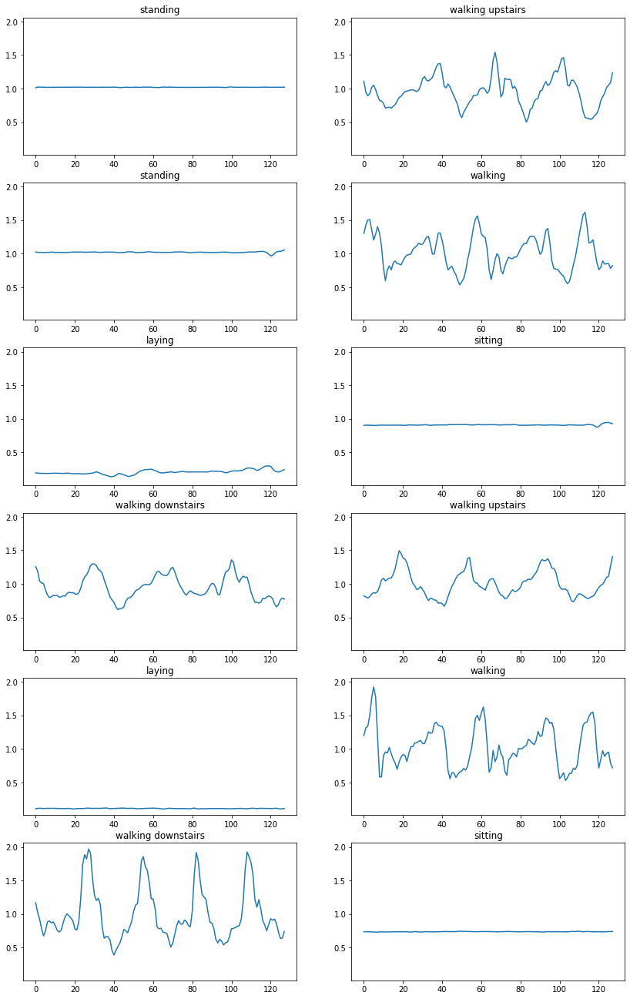
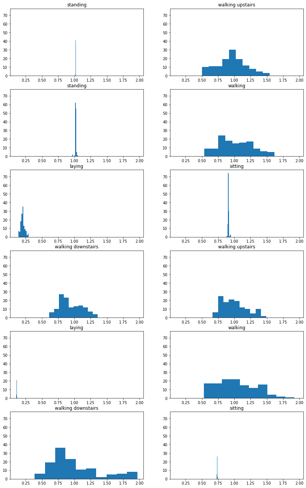
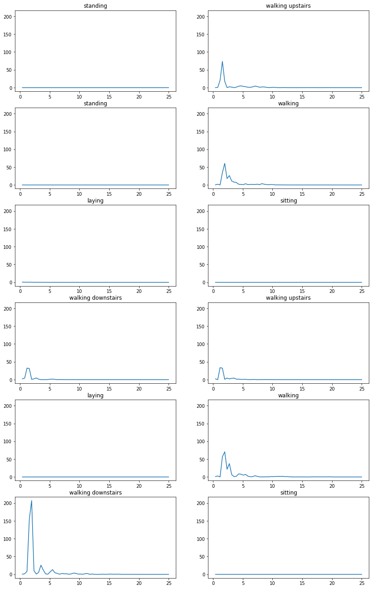
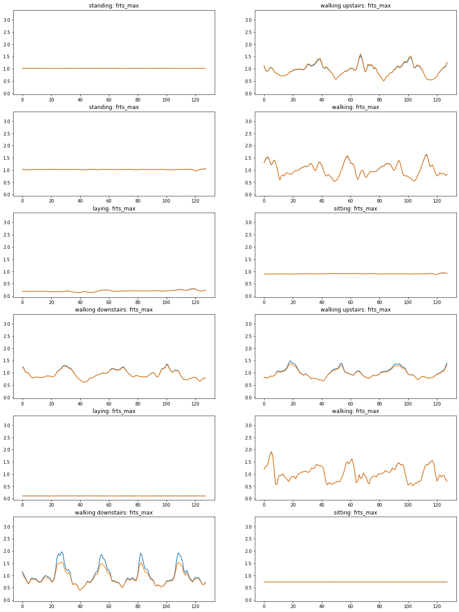
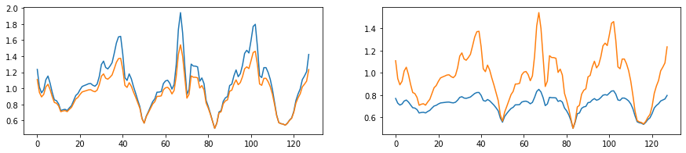
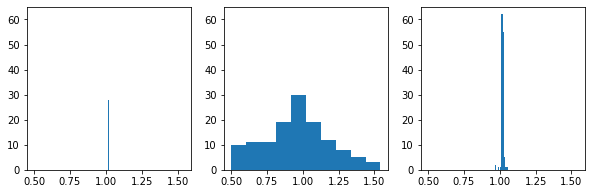

This note preserves a July 13, 2020 notebook on a "nudged Box-Cox" augmentation
idea for time-series classification. The notebook was part of a short burst of
sensor time-series augmentation work that also included homotopic augmentation,
noise-level estimation, and a broader literature/research journal.

## The Idea

Sklearn and SciPy both have a Box-Cox implementation:

- Sklearn Box-Cox: <https://scikit-learn.org/stable/modules/generated/sklearn.preprocessing.power_transform.html>
- SciPy Box-Cox: <https://docs.scipy.org/doc/scipy/reference/generated/scipy.stats.boxcox.html>

However, the Sklearn implementation does not return the lambda parameter, so I
used the SciPy one for the most part.

I was about to write my own inverse Box-Cox code, but then I found SciPy also
had that:

- <https://docs.scipy.org/doc/scipy/reference/generated/scipy.special.inv_boxcox.html>

Pseudocode for my idea:

```text
1. Compute the "nudge" that will make time series positive definite (requirement for Box-Cox).
2. Nudge the time series s.t. it is positive definite.
3. Compute its lambda parameter.
4. Randomly select a small perturbation of the lambda parameter.
5. Inverse Box-Cox transform the data using perturbed lambda parameter.
6. Inverse "nudge" back into original offset.
```

Box-Cox Transform:

```text
y = (x ** lmbda - 1) / lambda,  for lambda > 0
    log(x),                     for lambda = 0
```

Inverse Box-Cox Transform:

```text
x = (y*lambda + 1) ** (1/lambda),  for lambda > 0
    exp(y),                        for lambda = 0
```

## Objective

One of my 6-month goals was developing a "data augmentation for time series
classificaton" review paper. However, I did not want it to merely be a review
paper. I wanted to contribute some interesting augmentation strategies.

In this notebook, I cover time-domain nudged Box-Cox augmentations.

Other ideas for other notebooks included:

- freq-domain phase noise
- freq-domain amplitude noise
- freq-domain structured amplitude amplification/attenuation
- light freq-domain dropout
- partial dropout

## Sample Data

The sample data used here was just the accelerometer's x-axis. Sitting,
standing, and laying look very similar in the time domain, but sitting looks
much different than standing or laying when viewed as a histogram. While it may
be possible to classify these with a single axis, I suspected that the
signatures would really emerge in the triaxial setting.







## Percentage Perturbations

I first tried percentages, e.g. a 10% nudge, but since this is a power-law
transformation this does not really have a strong enough effect for larger
numbers. Nudging `40 -> (36,44)` leads to similar inverses.

```python
def percentage_perturbation_min_max(ts, percentage_perturbation):
    _pp = percentage_perturbation

    nudge = ts.min() - 1
    nudge_ts = ts - nudge
    bcts, bc_lambda = boxcox(nudge_ts.tolist())

    perturbation_min = (1 - _pp) * bc_lambda
    perturbation_max = (1 + _pp) * bc_lambda
    frts_min = inv_boxcox(bcts, perturbation_min) + nudge
    frts_max = inv_boxcox(bcts, perturbation_max) + nudge
    return perturbation_min, perturbation_max, frts_min, frts_max
```

This idea did not work too well.



## Power Nudges

Next idea was "power nudges": choose a power, then take the root power of lambda,
add a small nudge, e.g. `+/- 1`, and re-power. This works pretty well.

Some time series can handle power nudges up to, say, 5. Others are already
pretty heavily distorted at a power nudge of 2.

```python
def power_nudge_min_max(ts, power_perturbation):
    pp = power_perturbation

    nudge = ts.min() - 1
    nudge_ts = ts - nudge
    bcts, bcl = boxcox(nudge_ts.tolist())

    perturbation_min = np.power(np.power(bcl, 1.0 / pp) - 1, pp)
    perturbation_max = np.power(np.power(bcl, 1.0 / pp) + 1, pp)
    frts_min = inv_boxcox(bcts, perturbation_min) + nudge
    frts_max = inv_boxcox(bcts, perturbation_max) + nudge
    return perturbation_min, perturbation_max, frts_min, frts_max
```



## Analysis Of Power Nudges

Power nudges are working much better than the percentage nudges. However, while
some time series can handle power nudges up to 5, e.g. `ts0`, others are already
fairly distorted at 2, e.g. `ts1`. `ts2` is right in the middle, where a power
nudge of 2 or 3 looks best.

Some of this definitely has to do with the "flatness" of the distribution.

You can see that `ts0` is a relatively flat distribution:

- min: 1.013
- med: 1.019
- max: 1.025

However, `ts1` has much more variability:

- min: 0.501
- med: 0.968
- max: 1.542

As would be expected, `ts2` is a little more spread out.

So the power nudge is likely proportional to the spread. However, a simple
max-min spread is too strong: `ts2` has a relatively strong, semi-anomalous dip,
but can handle power nudges much better than `ts1`, where the spread is much
less due to anomaly.

It is also good to just look at the histograms.



"It's almost as if some of these gestures can just be classified by much simpler
means than neural networks," my brain whispered. "SHhhSHHh!" I yelled at my
brain.

So let's define a spread:

- can try interquartile range
- can try interdecile range

## Novelty Check

My novel technique might not be so novel.

During the course of this work, I stumbled across this StackExchange page:

- [Data Augmentation strategies for Time Series Forecasting](https://stats.stackexchange.com/questions/320952/data-augmentation-strategies-for-time-series-forecasting)

Near the bottom of the page, a user discusses a similar, but more sophisticated
augmentation technique that is similar in spirit: apply a Box-Cox transform,
change some stuff, then inverse transform the changes to get a new time series.

- Bergmeir et al. (2014): [Bagging Exponential Smoothing Methods using STL Decomposition and Box-Cox Transformation](http://citeseerx.ist.psu.edu/viewdoc/download?doi=10.1.1.450.5986&rep=rep1&type=pdf)

My technique is a bit different than the one found in the paper, but not
different enough to feel novel. Also, mine is a simpler, perhaps more naive
approach, so it might be worse. But who knows. It is almost always an empirical
game with this stuff. Either way, it was still useful to get this technique
working and add it to the review.

## Source Note

Curated in 2026 from
`notebooks/nudged-box-cox-augmentation_20200713.ipynb` in the standalone
`time-series-data-augmentation` archive. The original notebook records this idea
as independently generated on July 10, 2020 and explored in notebook form on
July 13, 2020.
