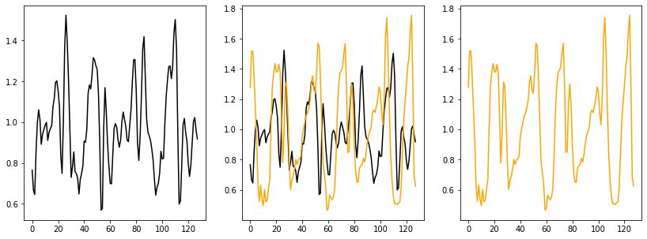
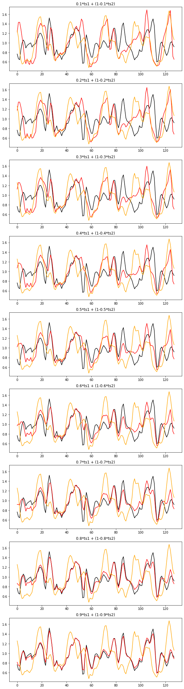
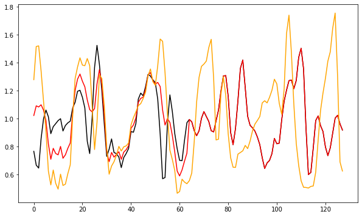
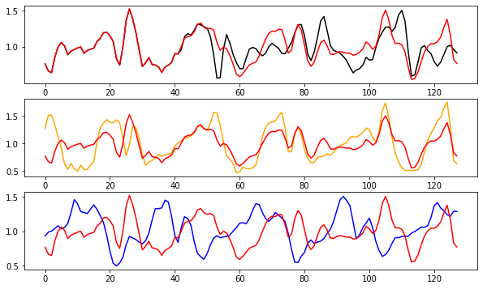
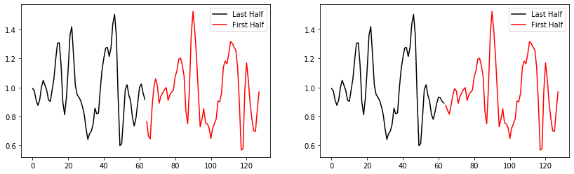

This note preserves a July 15, 2020 notebook exploring homotopic augmentation
ideas for wearable/sensor time series. The basic idea is to generate new samples
by moving one signal partway toward another signal, either globally or only over
selected intervals.

## Source Walking Signals

The notebook starts with UCI HAR walking examples.



## Full Homotopy

The simplest form was a convex interpolation between two time series:

```python
ts = k * ts1 + (1 - k) * ts2
```

The notebook sweeps across values of `k`, using one walking time series as the
black source curve, another as the orange source curve, and the red curve as the
interpolated signal.



## Partial Homotopies

In this case, we can:

- homotopically augment an interval of a specific time series, leaving the rest
  unaffected
- homotopically augment multiple intervals with multiple other time series

## Single Partial Homotopy

```python
ts1 = w1.copy()
ts2 = w4.copy()
half = ts.shape[0] // 2

ts = ts1.copy()
ts[:half] = 0.5 * ts1[:half] + (1 - 0.5) * ts2[:half]
```



## Multi-Partial Homotopies

```python
ts1 = w1.copy()
ts2 = w4.copy()
ts3 = w5.copy()
third = ts.shape[0] // 3

ts = ts1.copy()
ts[third:2 * third] = 0.5 * ts1[third:2 * third] + (1 - 0.5) * ts2[third:2 * third]
ts[2 * third:] = 0.5 * ts1[2 * third:] + (1 - 0.5) * ts2[2 * third:]
```



## Translation Invariance Via Circular Wrapping

In this case, you smooth homotopy first and last `x` points progressively.

For example, say we look at the first and last 10 points:

```text
Sequential permutation.

arr0 = [1,2,3,4,5,6,7]
arr1 = [3,4,5,6,7,1,2]
```

The notebook then sketches a tapering operation for circular wrapping:

```python
ts1 = w1.copy()
mean = np.concatenate([ts1[:10], ts1[-10:]]).mean()
weights = np.arange(0.1, 1, 0.1)
taper_left = weights * ts1[:9] + (1 - weights) * mean
taper_right = np.flip(weights) * ts1[-9:] + (1 - np.flip(weights)) * mean
```



## Source Note

Curated in 2026 from
`notebooks/KU_homotopic-augmentations20200715.ipynb` in the standalone
`time-series-data-augmentation` archive. The notebook ends with additional
headings for whitening techniques, Brownian/derivative assumptions, and spectral
indices, but those sections were not developed in this particular notebook.
