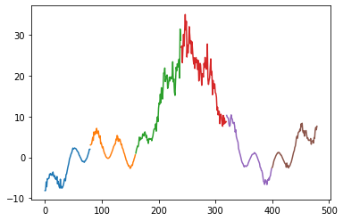
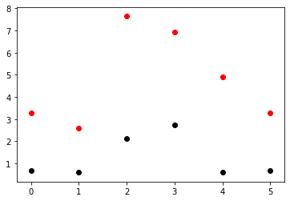
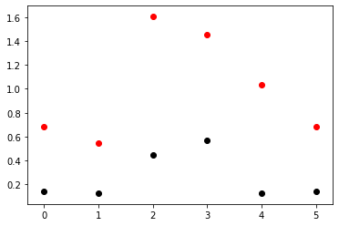

This note preserves a July 16, 2020 notebook and journal entry about choosing
noise-injection levels for time-series augmentation. The core claim is that
global window variance can make plausible-looking noise levels far too large,
and that local variation, estimated with first differences, is often the more
natural scale.

## The Intuition

It might not matter since GANs and related techniques exist to ascertain optimal
noise levels for data augmentation, but my guess is that the reason noise
injection has been shown to work poorly for LSTMs is because people are choosing
noise levels that are too high.

Time series values can range over a large swath of values in any given window,
which will be associated with a large variance. However, this variance is a
global property and has nothing to do with localized variances in small
neighborhoods of points. Basing one's noise injection off this global-scale
variance will almost surely result in adding too much noise.

For any sequence, or time series, the appropriate noise level for injection
should be estimated by looking at the variance of the first differences, which
better estimates the relationships that exist between nearest neighbors.

Typically, many practitioners choose a noise level, i.e. standard deviation, that
is about 5-10% the standard deviation of the data. Also, most practitioners
standardize their data in one way or another such that their time series more or
less have a std near 1.0. With this in mind, you will often see them choose
noise-level values of 0.05 to 0.1.

So is 0.05-0.10 too high a noise level? My argument is a strong "yes."

Let's just look at some examples: take a simple sine wave with an amplitude of
`sqrt(2)` such that it has a standard deviation of 1.0.

```python
ts = np.sqrt(2) * np.sin(np.arange(-6, 6, 0.05) * np.pi)
ts.std()
```

```text
1.0000000000000018
```

```python
np.diff(ts).std()
```

```text
0.15659088082932915
```

Holy smokes, right?! The typical spread between neighbors is just under 16% what
it is for the global spread. This means that the "common sense" noise levels of
0.05 to 0.1 are basically distorting everything way too much.

If we applied the 5-10% rule to the localized standard deviation, we would decide
that appropriate noise levels range between 0.008 and 0.016, much smaller levels
of noise than most of the HAR researchers use.

## Windowed Synthetic Series

The notebook then builds a more complicated synthetic time series from sinusoidal
components, a linear trend, a spike, and multiplicative noise. It cuts that
series into six consecutive 80-point windows.



The windowed time series has six consecutive instances of 80-point,
single-channel time series. In most of work, this should have a shape like:

- `(batch, timesteps, channels)`
- `(6, 80, 1)`

## Stats Of It All

I've said this elsewhere and often, and I'll say it again:

Generally, when computing statistics on a batch of time series, you must compute
**the batch average of the temporal statistics**. Oftentimes you will see
practitioners computing the temporal average of the batch statistics instead.
This mistake likely occurs due to a few factors:

- tools like sklearn and numpy default to certain behaviors, with a more
  non-temporal, features-based perspective in mind
- some people are not intimately familiar with time series, and the subtleties in
  processing them versus tabular data
- some people do not carefully think about what pre-packaged code is doing and
  why
- often it does not matter because, e.g., a neural net might figure out what to
  do anyway

If I am being 100% honest, the first 3 bullets are why it is a pet peeve of
mine, but the last bullet is basically why it does not matter. Basically, when
estimating the group's standardization transformation, the mean is the same if
you compute it "correctly" or "incorrectly." From there, it is just down to what
number you are dividing each time series by.

Here is where being pedantic clashes with being practical. In either case, you
are going to be dividing each time series by the same number, so really the only
thing that matters is getting the time series in the range that neural nets can
chew on well.

However, this is something that can lead you astray when estimating noise levels,
where you do not care about global statistics, but only localized statistics.
This automatically means you better know how to compute batch statistics of time
series by batch averaging temporal statistics.

The following averages are equivalent:

- Average of the matrix all at once
- Batch-average of the temporal average
- Temporal-average of the batch average

However, the following standard-deviation estimates are not:

- StdDev of the matrix all at once
- Batch-average of the temporal StdDev
- Temporal-average of the batch StdDev

```python
print(f"Mean of Matrix: {wts.mean():20.3}")
print(f"Batch Avg of the Temporal Avg: {wts.mean(axis=1).mean():5.3}")
print(f"Temporal Avg of the Batch Avg: {wts.mean(axis=0).mean():5.3}")
```

```text
Mean of Matrix:                 5.84
Batch Avg of the Temporal Avg:  5.84
Temporal Avg of the Batch Avg:  5.84
```

```python
print(f"StdDev of Matrix: {wts.std():21.3}")
print(f"Batch Avg of the Temporal StdDev: {wts.std(axis=1).mean():5.3}")
print(f"Temporal Avg of the Batch StdDev: {wts.std(axis=0).mean():5.3}")
```

```text
StdDev of Matrix:                  9.45
Batch Avg of the Temporal StdDev:  4.78
Temporal Avg of the Batch StdDev:  9.16
```

## Anyway, Noise Levels

Here, doing things the right way benefits you again because the wrong way
estimates high, global-view noise, whereas ultimately we care most about
localized noise estimates.

Without standardization:

```text
Global Window Noise
['3.273', '2.602', '7.664', '6.929', '4.919', '3.266']

Local Window Noise
['0.689', '0.619', '2.140', '2.725', '0.615', '0.662']
```



This is the typical way people do things, however it can be sensitive to a few
windows with extreme differences in values:

- for the window's global estimate, this is a difference between min and max
  values in the window
- for the localized first-difference estimate, this can happen if there are any
  sudden spikes

In our time series above, you can see both of these things happening in the
middle two windows, which generally have much higher global and local variances
than the outer four windows.

## With Standardization

After standardization, the global estimates for "optimal" noise injection are
exactly in line with what people typically use. So, if they are using
BATS-standardized time series, then at least they are "wrong in the right way."
But we already know people report this to not work out well, and we see that the
localized estimates are 10-30% smaller than this.



For BATS-standardized time series, the notebook estimated:

```text
MEAN
Globalized Deviation Mean is 1.0, which implies an appropriate
noise range of [0.05 0.1 ]

Localized Deviation Mean is 0.26, which implies an appropriate
noise range of [0.01 0.03]

MEDIAN
Globalized Deviation Median is 0.858, which implies an appropriate
noise range of [0.04 0.09]

Localized Deviation Median is 0.142, which implies an appropriate
noise range of [0.007 0.014]
```

For TABS-standardized time series, the notebook estimated:

```text
MEAN
Globalized Deviation Mean is 0.522, which implies an appropriate
noise range of [0.03 0.05]

Localized Deviation Mean is 0.136, which implies an appropriate
noise range of [0.007 0.014]

MEDIAN
Globalized Deviation Median is 0.447, which implies an appropriate
noise range of [0.02 0.04]

Localized Deviation Median is 0.0738, which implies an appropriate
noise range of [0.004 0.007]
```

## Recap

Presuming the minimum median and maximum mean define the exploratory range in
which to try noise injection levels:

```text
Exploratory BATS Range: [minMed, maxMean] = [0.007, 0.03]
Exploratory TABS Range: [minMed, maxMean] = [0.004, 0.014]
Overall Exploratory Range:       [min, max] = [0.004, 0.03]
```

Optimistically speaking, if people were estimating optimal noise injection
levels for time series data, we would see values in the range `0.007-0.030`,
meaning that Um2017 at `0.05` is just outside the maximum of this range.

Pessimistically speaking, optimal noise levels for standardized time series
would be in the range `0.004-0.014`, which means that Um2017 is about 3.5-12.5x
larger than the optimal values, while Ohashi is at minimum 7-25x larger for
their minimum noise level of `0.1`. Of course noise injection failed for them,
right?

## Source Note

Curated in 2026 from
`notebooks/KU_noise-injection-levels-for-time-series_20200716.ipynb` and the
2020-07-16 entry of `journal/kevins-data-augmentation-journal.md` in the
standalone `time-series-data-augmentation` archive.
