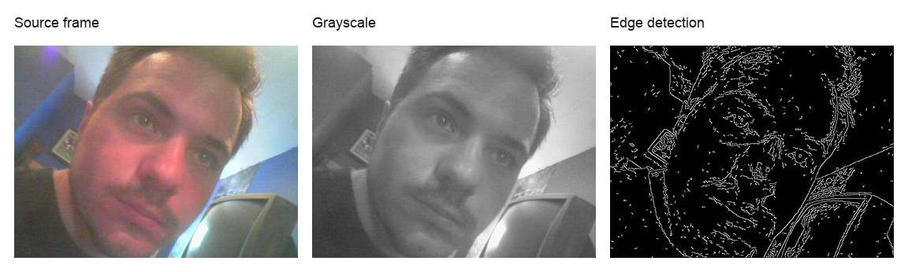

This short note preserves a pair of 2020 OpenCV scratch notebooks where I was
working out how to treat a webcam as a live image stream inside Jupyter:
capture a frame, transform it, display it inline, and update the same output as
new frames arrived.

For this archive version, I replaced the original ad hoc webcam output with an
intentional still image and recreated the same basic visual path: source frame,
grayscale conversion, and edge detection.



## Notebook Display

```python
from io import BytesIO

import IPython.display as display
from PIL import Image


def update_image(array, handle=None, fmt="jpeg"):
    buffer = BytesIO()
    Image.fromarray(array).save(buffer, fmt)
    image = display.Image(data=buffer.getvalue())

    if handle is None:
        return display.display(image, display_id=True)

    handle.update(image)
    return handle
```

## Webcam Loop

```python
import cv2


camera = cv2.VideoCapture(0)
handle = None

try:
    for frame_number in range(100):
        ok, frame = camera.read()
        if not ok:
            break

        frame_rgb = cv2.cvtColor(frame, cv2.COLOR_BGR2RGB)
        handle = update_image(frame_rgb, handle)
finally:
    camera.release()
```

## Camera Indexes

```python
import cv2


def get_camera_indexes(limit=10):
    indexes = []

    for index in range(limit):
        camera = cv2.VideoCapture(index)
        if camera.isOpened():
            indexes.append(index)
        camera.release()

    return indexes
```

## Grayscale and Edges

```python
import cv2
import numpy as np


ok, frame = camera.read()

if ok:
    gray = cv2.cvtColor(frame, cv2.COLOR_BGR2GRAY)
    small = cv2.resize(gray, (100, 100))
    edges = cv2.Canny(small, 100, 200)
    edges_rgb = np.dstack([edges] * 3)
```

## Takeaway

Before worrying about a full vision application, make the data stream visible.
Once frames are visible, the camera index, frame shape, color order, frame rate,
and image-processing steps become much easier to reason about.

## Source Note

Curated in 2026 from two December 7, 2020 scratch notebooks:

- `2020-or-earlier_a-solution-that-works_computer-vision.ipynb`
- `2020-or-earlier_computer-vision-2.ipynb`

The original notebooks contained ad hoc webcam output. This article keeps the
useful OpenCV/Jupyter workflow and uses a deliberate still image as the public
demo frame.
