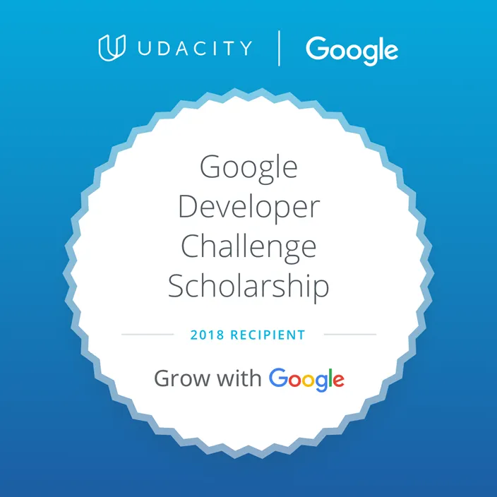

# Google Developer Scholarship Notes, 2018

This directory preserves notes from the 2018 Grow with Google / Udacity web
developer scholarship period. It is kept as a lightweight historical archive,
not as a polished or actively maintained web-development project.

The material is mostly notes, screenshots, and small examples around:

- progressive web apps and offline-first design
- service workers
- IndexedDB and browser storage
- JavaScript syntax and language features
- responsive design
- JavaScript design patterns
- AJAX, Fetch, and promises
- Gulp, SASS, npm, and web tooling

## Contents

- `Round1/`: PWA/offline-first notes, service workers, IndexedDB, JavaScript
  syntax, functions, promises, and proxies.
- `Round1/Supplementary-Courses/`: supporting notes from JavaScript, DOM,
  HTML/CSS, AJAX, and promise courses.
- `Round2/`: responsive design, emulators/simulators, layout patterns, and
  design-pattern notes.
- `Round2/Supplementary-Courses/`: responsive-web-design, web tooling, SASS,
  npm, and related notes.

## Cleanup Notes

The repository was cleaned before being folded into the broader `kitchensink`
archive. The cleanup intentionally removed:

- historical `node_modules/` contents
- course starter/demo code that can be re-obtained from Udacity or the original
  source project
- duplicate markdown files
- placeholder `images/README.md` files
- old `.DS_Store` metadata
- a historical `.mov` demo file
- bulky Android Studio, Xcode, and simulator setup screenshots

Some older notes still mention omitted setup screenshots or external sample
projects. Those references are kept as context, but the large or reproducible
assets are not stored here.

## Historical Context

The git history in this folder dates from January 2018 through July 2018. The
repository reflects a period of broad web-development study: trying to learn
PWAs, modern JavaScript, responsive design, browser APIs, and frontend tooling
alongside other technical interests.

## External References

- You Don't Know JS: <https://github.com/getify/You-Dont-Know-JS>
- JavaScript 30: <https://javascript30.com/>
- Google Codelabs: <https://codelabs.developers.google.com/>
- Google developer training: <https://developers.google.com/training/>
- PWA material from Google/Udacity:
  <https://developers.google.com/web/fundamentals/codelabs/your-first-pwapp/>

## Related Historical Articles

These blog articles were written during or around the 2018 Grow with Google / Udacity scholarship period and are kept in the top-level article archive.

- [Google Developer Scholarship](../../articles/2018/2018-01-12-Google-Developer-Scholarship.md) (2018-01-12)
- [Google Developer Scholarship: Back to the Basics of JavaScript](../../articles/2018/2018-01-26-Google-Developer-Scholarship-Back-to-the-Basics-of-JavaScript.md) (2018-01-26)
- [Google Developer Scholarship: Back to the Basics of HTML and CSS](../../articles/2018/2018-02-02-Google-Developer-Scholarship-Back-to-the-Basics-of-HTML-and-CSS.md) (2018-02-02)
- [Google Developer Scholarship: Asynchronous JavaScript Requests](../../articles/2018/2018-03-06-Google-Developer-Scholarship-Asynchronous-JavaScript-Requests.md) (2018-03-06)
- [Google Developer Scholarship: JavaScript Promises](../../articles/2018/2018-03-15-Google-Developer-Scholarship-Javascript-Promises.md) (2018-03-15)
- [Hello, Node.js!](../../articles/2018/2018-03-16-Hello-Node-JS.md) (2018-03-16)
