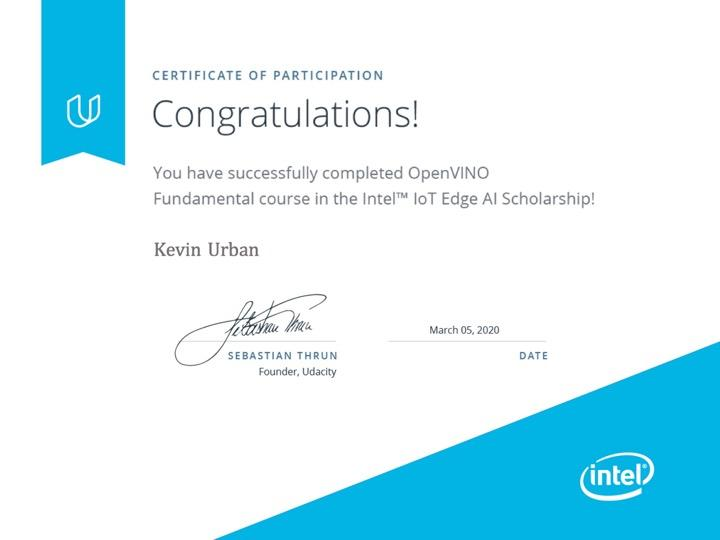

# Udacity AI for IoT Developers Nanodegree

Historical archive of a 2020 edge-AI / IoT learning project, centered on
Udacity's OpenVINO people-counter assignment.

This is mainly worth preserving because it captures the practical mess of
getting computer-vision models onto edge hardware in 2020: Python 3.5-era
tooling, OpenVINO 2019, TensorFlow object-detection models, FFMPEG, MQTT, Node,
Raspberry Pi plans, and Intel Neural Compute Stick / MYRIAD debugging.

## Dates

The preserved Git history for this work runs from May 26, 2020 through July 15,
2020. This archive is kept as historical learning evidence rather than as a
freshly modernized implementation.

## What I Worked On

- Tried to move beyond the Udacity classroom workspace and run the project
  locally, closer to the spirit of deploying models on edge devices.
- Took notes on a Python 3.5 / OpenVINO / FFMPEG / Node environment that was
  already fragile by 2020.
- Compared TensorFlow Hub and TensorFlow Object Detection Model Zoo options for
  people detection.
- Narrowed candidate models using speed and mAP tradeoffs, then downloaded and
  inspected model artifacts.
- Wrote small shell helpers for downloading TensorFlow models and converting
  them to OpenVINO Intermediate Representation files.
- Saved conversion logs for FP16/FP32 OpenVINO optimization attempts.
- Investigated Intel Neural Compute Stick 2 / MYRIAD behavior and documented
  hardware/runtime issues.

## Journal Guide

The densest personal artifact is `p01_people-counter/JOURNAL.md`. Useful sections
include:

- `Some Specs`: local Mac, Conda, Python 3.5, FFMPEG, NPM, and package notes.
- `Models`: why TensorFlow Hub was less useful here and why the TensorFlow Model
  Zoo became the main source.
- `Choosing a Model`: speed/accuracy filtering, mAP notes, and candidate model
  reasoning.
- `Download and Inspect the Models`: model download and unpacking workflow.
- `The Model Optimizer`: OpenVINO setup and conversion commands.
- `Attempted Model Optimizations`: environment debugging and conversion pain.
- `Model Optimization`: notes and logs for specific SSD MobileNet / SSD ResNet
  conversion attempts.
- `Update Model Size Tables`: rough comparison of model output sizes.
- `A Note on Running Locally`: local server configuration notes.

## Artifact Map

- `p01_people-counter/README.md`: short project-level overview of the preserved
  people-counter work.
- `p01_people-counter/JOURNAL.md`: main 2020 working notes.
- `p01_people-counter/notes/object-detection.md`: conceptual object-detection
  notes.
- `p01_people-counter/notes/myriad-issues.md`: Intel NCS2 / MYRIAD debugging.
- `p01_people-counter/src/models/`: helper scripts for downloading TensorFlow
  models and converting them to OpenVINO IR files.
- `p01_people-counter/logs/`: saved conversion/model-size notes from the 2020
  experiments.
- `p01_people-counter/UDACITY_ORIGINAL_README.md`: the course assignment README,
  kept as context instead of being mixed into the project overview.

## Large Files

Generated OpenVINO and TensorFlow model artifacts are intentionally excluded
from the preserved working tree. The original model outputs were large binary
files and are better treated as reproducible artifacts from the scripts and
notes, not as source files to keep in Git.

The small sample video is retained because it keeps the original project context
without making the archive large.

## Historical Status

This archive is not a polished final implementation. My original goal was to run
the people-counter project locally and eventually test it on a Raspberry Pi with
an Intel Neural Compute Stick 2, but the course-era tooling was fragile and time
constraints made the supported Udacity environment the practical path for
finishing the class.

Some of the setup, debugging, model-selection, and OpenVINO conversion work is
captured here, especially in `JOURNAL.md`, but not every experiment made it into
Git. This folder is preserved as evidence of the 2020 learning process around
edge AI deployment rather than as a complete production-ready application.

## Status

This should be read as a preserved course-era project and notebook-adjacent
learning record. The project contains starter-code scaffolding from the Udacity
assignment plus personal notes and experiments; it is not presented as a
completed production people-counter application. 