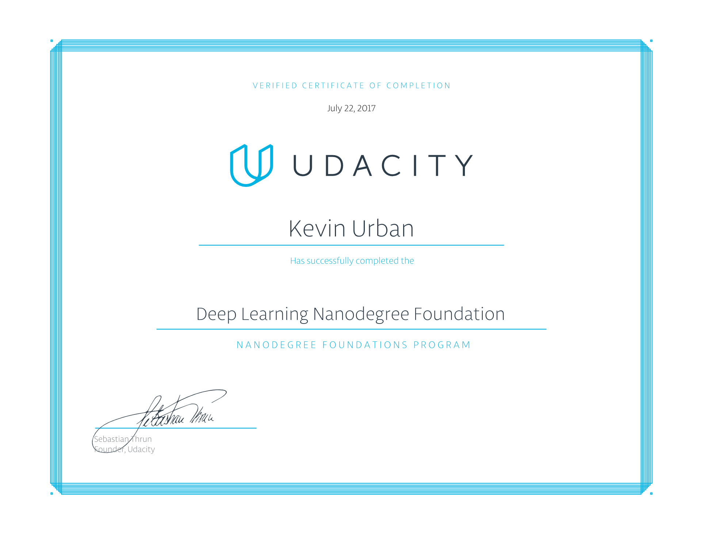

# Self-Driving Car Nanodegree Notes, 2017

This directory preserves early Udacity Self-Driving Car Nanodegree work from
2017. It is kept as historical evidence of study and experimentation around
computer vision, neural networks, TensorFlow, and autonomous-driving project
work.

The original work in this imported history dates from roughly June 2017 through
November 2017. The repository was cleaned before import into `kitchensink` so
that generated files, duplicate notebook checkpoints, trained model checkpoints,
and large course-provided videos are not stored in git.

This is not a modernized or fully reproducible 2026 project. Some notebooks may
need old dependencies, missing course datasets, or small code updates before
they run again.

## Contents

### Notes

- `01__Welcome.md`
- `03__Career-Resource-Notes.md`
- `04__Intro-to-Neural-Networks.md`
- `05__MiniFlow.md`
- `06_Intro-to-TensorFlow.md`
- `07__Deep-Neural-Networks.md`
- `08__Convolutional-Neural-Networks.md`
- `09__Traffic-Sign-Classifier.md`
- `images/`

These files are mostly course notes and diagrams from the early part of the
nanodegree, especially neural-network basics, backpropagation, TensorFlow, and
convolutional networks.

### TensorFlow Lab

- `06__Lab__TF-Lab/CarND-TensorFlow-Lab.ipynb`

Introductory TensorFlow notebook from the Udacity course era. This notebook was
written against the TensorFlow 1.x style API and should be treated as historical
material unless a compatibility environment is added later.

### LeNet Lab

- `08__Lab__LeNet-in-TensorFlow/LeNet-Lab.ipynb`
- `08__Lab__LeNet-in-TensorFlow/LeNet-Lab-Solution.ipynb`
- `08__Lab__LeNet-in-TensorFlow/README.md`

Simple convolutional-network work based on LeNet/MNIST. This is useful as a
snapshot of the 2017 TensorFlow workflow: placeholders, sessions, explicit
training loops, and notebook-based model inspection.

### Project 1: Finding Lane Lines

- `P1_Finding-Lane-Lines-on-the-Road/P1.ipynb`
- `P1_Finding-Lane-Lines-on-the-Road/README.md`
- `P1_Finding-Lane-Lines-on-the-Road/NOTES.md`
- `P1_Finding-Lane-Lines-on-the-Road/test_images/`
- `P1_Finding-Lane-Lines-on-the-Road/pipeline_images/`

This project uses OpenCV image-processing steps to find lane lines:
grayscale conversion, Gaussian blur, Canny edge detection, region masking,
Hough line detection, and line overlay smoothing.

The project README is the main writeup for this mini-project. The large input
and output videos were intentionally removed, but the notebook, writeup, test
images, and selected pipeline images remain.

### Project 2: Traffic Sign Classifier

- `P2_Traffic-Sign-Classifier/Traffic_Sign_Classifier.ipynb`
- `P2_Traffic-Sign-Classifier/GAN-Upsampling.ipynb`
- `P2_Traffic-Sign-Classifier/signnames.csv`
- `P2_Traffic-Sign-Classifier/german_signs_from_internet/`
- `P2_Traffic-Sign-Classifier/visualize_cnn.png`

This project explores traffic-sign classification using the German Traffic Sign
Recognition Benchmark-style project data used in the course. It includes a CNN
classifier notebook and a small GAN upsampling experiment.

The trained `signNet` checkpoint files were removed from history. The pickled
training, validation, and test datasets are also not stored here.

## Omitted Files

The following kinds of files were intentionally left out of this preserved
version:

- Large course-provided lane-line videos.
- Generated lane-line output videos.
- Duplicate `.ipynb_checkpoints` notebooks.
- TensorFlow checkpoint files such as `signNet.*`.
- Local macOS metadata such as `.DS_Store`.
- Large course datasets such as `train.p`, `valid.p`, and `test.p`.

The goal is to preserve the learning artifacts without turning this historical
folder into a large data or model artifact store.

## Reproducibility Notes

These notebooks are old enough that they should not be expected to run in a
modern Python environment without adjustment.

Likely requirements by area:

- Lane-line project: Python, Jupyter, NumPy, OpenCV, Matplotlib, MoviePy.
- TensorFlow and LeNet labs: old TensorFlow 1.x-era APIs or a compatibility
  rewrite.
- Traffic-sign classifier: old TensorFlow 1.x-era APIs plus the original
  Udacity/GTSRB-style pickled data files.

If rerunning the traffic-sign classifier, place the course dataset files in the
location expected by the notebook:

- `P2_Traffic-Sign-Classifier/train.p`
- `P2_Traffic-Sign-Classifier/valid.p`
- `P2_Traffic-Sign-Classifier/test.p`

Useful external references:

- Udacity lane-lines starter project:
  <https://github.com/udacity/CarND-LaneLines-P1>
- Udacity traffic-sign classifier starter project:
  <https://github.com/udacity/CarND-Traffic-Sign-Classifier-Project>
- German Traffic Sign Recognition Benchmark:
  <https://benchmark.ini.rub.de/gtsrb_dataset.html>

## Notebook Rendering

The notebooks in this directory parse as valid notebook JSON locally. A cleanup
pass removed empty legacy widget metadata that caused GitHub's notebook renderer
to report some files as invalid. If GitHub still fails to render one of these
old notebooks, open it in VS Code, JupyterLab, or classic Jupyter instead.

## Historical Status

This directory is preserved mainly for portfolio context: it shows early work
with neural networks, TensorFlow, classical computer vision, CNNs, and
autonomous-driving course projects from 2017.

For modern work, prefer creating a fresh 2026 companion project with current
libraries, explicit environment setup, smaller reproducible sample data, and
updated notebook execution paths.
